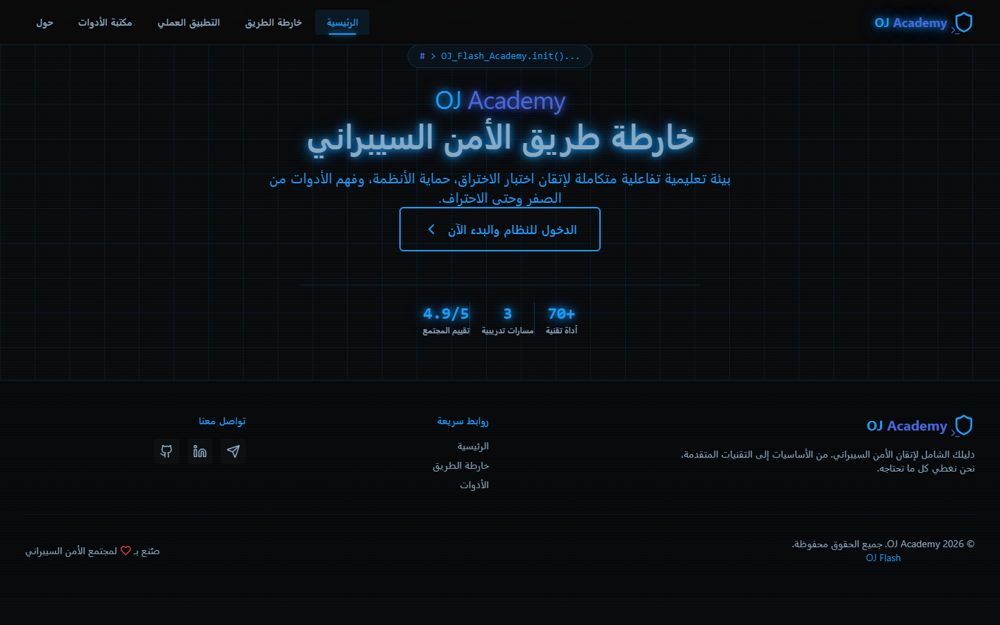
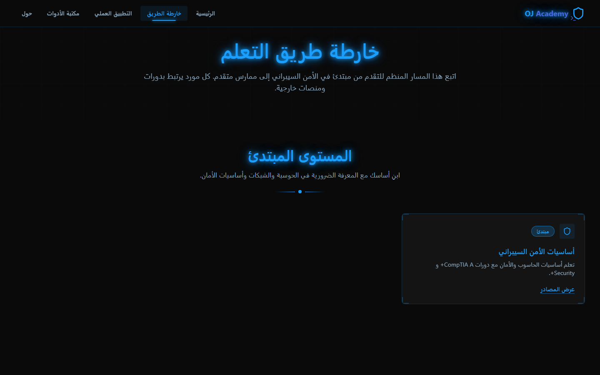
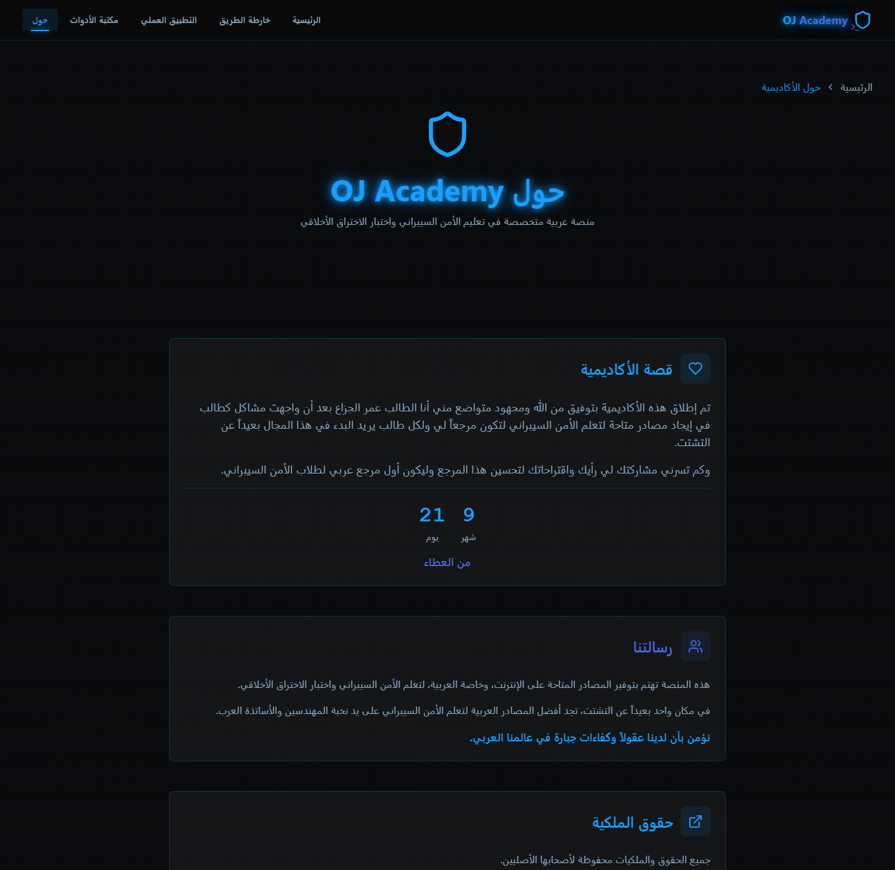

# OJ Academy — خارطة طريق الأمن السيبراني

**OJ Academy** منصة تعليمية عربية متخصصة في الأمن السيبراني واختبار الاختراق الأخلاقي — من الأساسيات وحتى الاحتراف.

> بيئة تعليمية تفاعلية لإتقان اختبار الاختراق، حماية الأنظمة، وفهم الأدوات من الصفر وحتى الاحتراف.

موقع تفاعلي (React + Vite + Tailwind CSS) بواجهة عربية RTL كاملة، منشور على GitHub Pages من مستودع [OjFlashAcademy](https://github.com/omarjazaa/OjFlashAcademy) على الرابط: **[omarjazaa.github.io/OjFlashAcademy](https://omarjazaa.github.io/OjFlashAcademy/)**



## لقطات من الموقع

| خارطة الطريق | حول الأكاديمية |
|---|---|
|  |  |

---

## نظرة عامة

| العنصر | التفاصيل |
|---|---|
| الاسم | OJ Academy (البراند النصي في الفوتر: `OJ Flash`) |
| اللغة | عربي بالكامل (RTL) |
| الخطوط | Tajawal للواجهة، JetBrains Mono للمحتوى التقني |
| الثيم | داكن بألوان نيون زرقاء |
| الواجهة الرئيسية | تسلسل إقلاع نظام `> OJ_Flash_Academy.init()...` مع خلفية جزيئات متحركة (Canvas) |
| الإحصائيات المعروضة | 70+ أداة تقنية · 3 مسارات تدريبية · تقييم المجتمع 4.9/5 |
| كود الخصم | `OJFLASH` |
| التواصل | [Telegram](https://t.me/FBI_OJ) · [LinkedIn](https://www.linkedin.com/in/al-jazaa) · [GitHub](https://github.com/omarjazaa) |

---

## الصفحات والمسارات

الموقع تطبيق صفحة واحدة (SPA) فيه **8 أقسام رئيسية** مع صفحات فرعية:

| القسم | المسار | المحتوى |
|---|---|---|
| الرئيسية | `/` | واجهة الدخول (Boot Sequence) + الإحصائيات + زر البدء |
| خارطة الطريق | `/roadmap` | 3 مستويات (مبتدئ / متوسط / متقدم) مع مسارات فرعية لكل موضوع |
| التطبيق العملي | `/practical-labs` | مختبرات وتمارين تطبيقية |
| مكتبة الأدوات | `/tools` | فهرس أدوات مصنّف (10 تصنيفات) مع أوامر تنفيذية وروابط رسمية |
| الكتب | `/books` | مكتبة كتب تخصصية مصنفة (OSINT، Cybersecurity، Pentester، Linux) |
| الشهادات | `/certifications` | دليل الشهادات المعتمدة عالمياً (Security+، CEH، eJPT، OSCP) |
| أقسام أخرى | `/other` | استكشاف الويب المظلم (Dark Web) والويب العميق (Deep Web) |
| حول | `/about` | قصة الأكاديمية، رسالتها، وحقوق الملكية |

**الصفحات الفرعية المنشورة** (كلها تفتح مباشرة بفضل إعداد الـ SPA على GitHub Pages):

- **خارطة الطريق:** `programming` · `networking` · `linux` (+ `linux/courses` · `linux/websites` · `linux/what-is-linux`) · `cybersecurity-basics` · `pentest-basics` · `web-pentest` (+ `web-pentest-resources`) · `web-programming-basics` · `active-directory` · `malware-analysis`
- **مكتبة الأدوات:** `network-pentest` · `web-pentest` · `network-analysis` · `recon` · `reverse-engineering` · `forensics` · `osint` · `wireless` · `password-attacks` · `vulnerability-scanners`
- **مكتبة الكتب:** `/books/osint` · `/books/cybersecurity` · `/books/pentester` · `/books/linux`
- **دليل الشهادات:** `/certifications/security-plus` · `/certifications/ceh` · `/certifications/ejpt` · `/certifications/oscp`
- **مواضيع متقدمة:** `/other/dark-web` · `/other/deep-web`
- **صفحات مصادر:** `/resources/websites` · `/resources/youtube-channels` · `/resources/comprehensive-courses`

أمثلة على الأدوات اللي بيغطيها الموقع: Nmap · Wireshark · Burp Suite · SQLMap · Metasploit · Responder · Amass · Ghidra · Autopsy · Volatility · Sherlock · Holehe · GHunt · exiftool · Hashcat · John · Hydra · Aircrack-ng · Nessus · Trivy وغيرها.

---

## هيكلية المستودع

```
.
├── index.html                      ← نقطة الدخول (مضبوطة بمسارات /OjFlashAcademy/...)
├── assets/                         ← حزمة البناء الجاهزة (JS + CSS)
├── branding-assets/                ← ملفات الهوية المصدرية (SVG + PNG)
├── favicon.ico · apple-touch-icon.png · og-image.jpg
├── logo.jpg                        ← الشعار المعتمد (نسخة وحيدة)
├── qr-code.png                     ← كود QR المعتمد (المستخدم بالواجهة)
├── dev/                            ← أدوات التطوير والأرشيف (خارج محتوى الموقع)
│   ├── rebrand_server.py           ← سيرفر معاينة محلي (منفذ 8000، يحاكي مسار /OjFlashAcademy/)
│   ├── REBRAND-HISTORY.md          ← الأرشيف الكامل لعملية إعادة العلامة
│   ├── screenshots/                ← لقطات الشاشة (منها ما قبل وبعد إعادة التسمية)
│   ├── logs/                       ← سجلات محلية (مستثناة من git)
│   └── archive/                    ← ملفات قديمة محفوظة للرجوع
├── 404.html                        ← إعداد الـ SPA على GitHub Pages (تحويل المسارات العميقة)
├── .nojekyll                       ← تعطيل معالجة Jekyll
├── .gitignore
└── README.md
```

---

## التشغيل محلياً

الموقع تطبيق SPA وأصوله تُطلب بمسارات مطلقة (`/OjFlashAcademy/...`)، لذلك لا تفتح `index.html` بالنقر المزدوج — شغّله عبر سيرفر المعاينة المرفق **من جذر المستودع** (المتطلب الوحيد: Python 3). السيرفر يعيد إنتاج مسار النشر الحقيقي محلياً:

```bash
python dev/rebrand_server.py
# ثم افتح: http://localhost:8000/OjFlashAcademy/
```

> ملاحظات: زيارة الجذر `/` توجّه تلقائياً إلى `/OjFlashAcademy/`، والسيرفر يدعم المسارات العميقة (مثل `/OjFlashAcademy/roadmap/linux`) ويمنع تخزين المتصفح المؤقت أثناء التطوير.

---

## النشر على GitHub Pages

الموقع منشور من مستودع [`omarjazaa/OjFlashAcademy`](https://github.com/omarjazaa/OjFlashAcademy) على الرابط:

**https://omarjazaa.github.io/OjFlashAcademy/**

**خطوات النشر (مرة واحدة):**

1. ارفع الفرع `main` إلى المستودع (المشروع مجهّز محلياً كمستودع git مع أول commit):

```bash
git remote add origin https://github.com/omarjazaa/OjFlashAcademy.git
git push -u origin main
```

2. من إعدادات المستودع: **Settings → Pages → Source: Deploy from a branch → Branch: `main` + folder `/ (root)` → Save**.

**ملاحظات مهمة للنشر:**

- المسارات داخل الموقع مضبوطة على اسم المستودع `/OjFlashAcademy/` (استدعاءات الملفات + صورة الـ QR + وسوم `og:image` و`twitter:image`). **إذا غيّرت اسم المستودع لاحقاً** بدّل هذه المواضع نفسها: مراجع الملفات في `index.html`، رابطا الميتا، وسطر واحد داخل `assets/index-BlADLk9O.js`.
- `404.html` + سكربت الـ SPA داخل `index.html` يطبقان نمط [spa-github-pages](https://github.com/rafgraph/spa-github-pages) حتى تفتح المسارات العميقة (مثل `/OjFlashAcademy/roadmap/linux`) مباشرة دون صفحة 404.
- ملف `.nojekyll` ضروري حتى لا يعالج GitHub Pages الملفات بـ Jekyll.
- كود الـ QR المصمم داخل `qr-code.png` يشاور على رابط placeholder قديم — يُفضَّل إعادة توليده بالرابط النهائي عند الرغبة.
- لإضافة دومين خاص لاحقاً: أضف ملف `CNAME` وحدّث الروابط المطلقة المذكورة أعلاه.

---

## الهوية البصرية

| الملف | الاستخدام |
|---|---|
| `academy/branding-assets/logo.svg` · `logo.png` | الشعار الكامل (SVG مصدري قابل للتعديل) |
| `academy/branding-assets/icon.svg` · `icon-512.png` | الأيقونة المربعة |
| `academy/branding-assets/og-image.svg` · `og-image.png` | مصدر صورة المشاركة |
| `academy/favicon.ico` | أيقونة المتصفح |
| `academy/apple-touch-icon.png` | أيقونة أجهزة Apple |
| `academy/og-image.jpg` | صورة المشاركة النهائية (Open Graph / Twitter) |

لوحة الألوان: أساسي `hsl(205 100% 55%)` (أزرق سماوي) · ثانوي `hsl(228 70% 58%)` (نيلي) · نيون أزرق `hsl(195 100% 50%)`.

---

## ملاحظات تقنية

- **البناء:** React + Vite — حزمة الإنتاج كاملة بملفين فقط داخل `assets/`: `index-BlADLk9O.js` و `index-BhPYGXCl.css`.
- **صورة الـ QR داخل التطبيق** تُطلب بمسار مطلق `/OjFlashAcademy/qr-code.png` — والملف موجود بجذر المستودع كنسخة وحيدة معتمدة (تم حذف النسخ المكررة).
- **الشعار:** `logo.jpg` نسخة وحيدة معتمدة (تم حذف النسخة المكررة `logo-new.jpg`).
- **صورة المشاركة (OG):** مضبوطة على `https://omarjazaa.github.io/OjFlashAcademy/og-image.jpg` داخل وسوم og/twitter في `index.html`.
- **Cloudflare Web Analytics** مضمّنة في `academy/index.html`.
- **إمكانية الوصول:** حزمة الأنماط تدعم `prefers-reduced-motion` (تقليل الحركة).
- **حقوق الملكية:** صفحة "حول" تعرض: "جميع الحقوق والملكيات محفوظة لأصحابها الأصليين".

---

## سجل إعادة العلامة (Rebrand History)

هذه النسخة هي ناتج البناء النهائي بعد إعادة تسمية كاملة للموقع. الوثيقة التفصيلية لكل التعديلات — الأسماء، الألوان، الروابط، الشعارات، مع برومبتات جاهزة لتطبيق نفس التعديلات على الكود المصدري — محفوظة **كما هي دون أي تعديل** في:

📄 [`dev/REBRAND-HISTORY.md`](dev/REBRAND-HISTORY.md)

كما يوجد في `dev/archive/` أرشيف كامل لما قبل إعادة الهيكلة (نسخة الدخول المحلية القديمة + بقايا قالب المشروع الأصلي).


